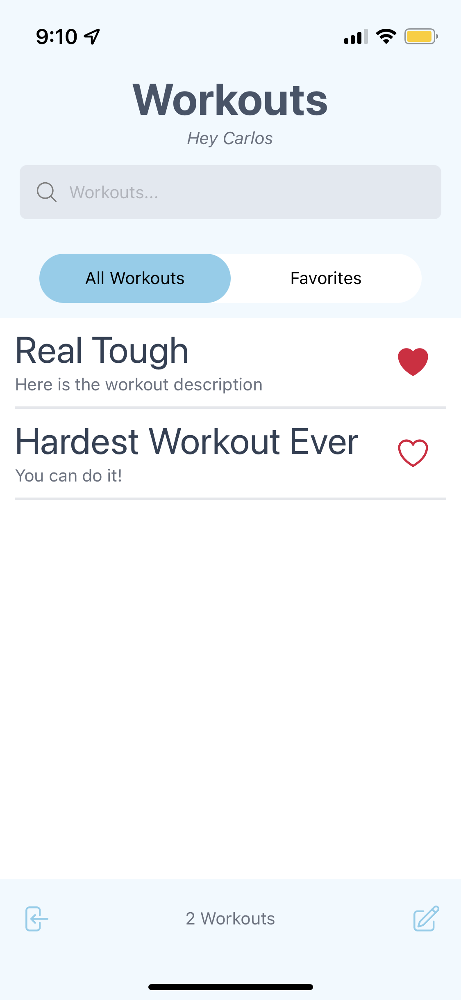
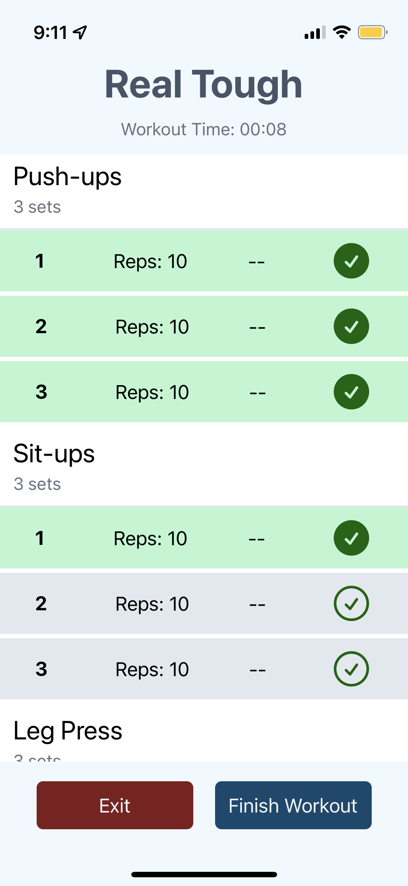

# Workout Tracker

This is a mobile app created with React Native. It is an app to create and track workout routines. 

## Overview

Users can
- Create and login to account using Firebase authentication
- Create, edit, favorite & delete workouts
- Track workouts

### Screenshot

### Links

TO view the app download the Expo GO app and scan the following QR code

### Built with

- [React Native](https://reactnative.dev/)
- [Expo](https://expo.dev/)
- [Firebase](https://firebase.google.com/)
- [Redux](https://redux.js.org/)
- [NativeWind](https://www.nativewind.dev/)
- [Heroicons](https://heroicons.com/)
- [React Native Switch Selector](https://www.npmjs.com/package/react-native-switch-selector)

### What I learned

This app worked on my understanding of using Firestore database, Redux and React Native. 

### Features to Add

- Ability to share workouts with other users
- Create a dashboard with workout results and stats
- Add achievemets and awards for completed workouts

## Author

- Website - [Mick Maratta](https://mickmaratta.me/)
- Linkedin - [Mick Maratta](https://www.linkedin.com/in/mick-maratta-149b79250/)
